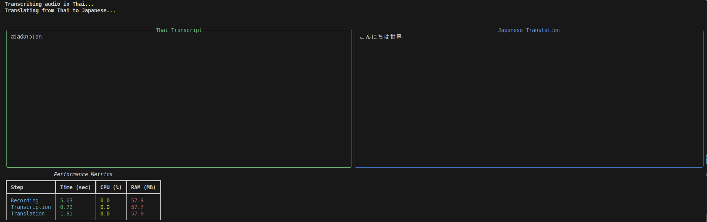

# Audio Translation System Documentation

This document provides an overview of the Audio2TextPy project, which offers speech recognition and translation capabilities in three different implementations. Each implementation serves different use cases and technical requirements.



## Project Structure

```
Audio2TextPy
 ┣ main_socket
 ┃ ┣ client.py
 ┃ ┗ server.py
 ┣ main_v1.py
 ┗ main_v2_realtime.py
```

## 1. Batch Processing Implementation (main_v1.py)

### Overview
The batch processing implementation records audio, processes it, and translates it in a sequential manner. This approach is suitable for non-time-sensitive applications or when resource optimization is important.

### Features
- Records audio in chunks until silence is detected
- Performs speech-to-text conversion using Google Speech Recognition API
- Translates text using Google Translate API
- Supports 4 languages: Thai, English, Spanish, and Japanese
- Provides visual feedback during recording (volume meter)
- Includes error handling for various audio device issues
- Performance monitoring for CPU, RAM usage, and processing time

### Usage Flow
1. Select input audio device
2. Choose source and target languages
3. Record speech (automatically stops after detecting silence)
4. Process and convert speech to text
5. Translate text to target language
6. Display both original text and translation
7. Show performance metrics
8. Option to repeat the process

### Technical Notes
- Uses PyAudio for audio recording
- Uses SpeechRecognition library for speech-to-text
- Uses Googletrans for translation
- Uses psutil for performance monitoring
- Uses Rich library for console UI
- Handles various sample rates for better device compatibility

## 2. WebSocket Implementation (main_socket/)

### Overview
The WebSocket implementation separates the audio recording (client) from the processing and translation (server). This approach is ideal for distributed systems, web applications, or when processing needs to happen on a different machine than recording.

### Client (client.py)
- Records audio from the user's microphone
- Detects speech and silence periods
- Sends audio data to the server via WebSocket
- Receives and displays translation results
- Provides real-time visual feedback

### Server (server.py)
- Accepts WebSocket connections from clients
- Receives audio data from clients
- Processes speech-to-text conversion
- Translates text to requested target language
- Sends results back to clients
- Handles multiple client connections concurrently
- Monitors and reports performance metrics

### Features
- Distributed architecture separates concerns
- Enables web-based interfaces
- Supports multiple simultaneous users
- Real-time processing pipeline
- Cross-platform compatibility
- Performance monitoring on server side
- Scalable for cloud deployment

### Technical Notes
- Uses websockets library for communication
- Implements asynchronous processing with asyncio
- Uses concurrent.futures for parallel processing
- Same language support as the batch implementation
- Includes error handling and reconnection logic
- Can be deployed on separate machines

## 3. Threading-based Real-time Implementation (main_v2_realtime.py)

### Overview
The threading-based real-time implementation processes audio continuously as it's being recorded. This approach provides the lowest latency and best user experience for applications requiring immediate feedback.

### Features
- Continuous audio processing without waiting for complete utterances
- Parallel processing using multiple threads
- Queue-based architecture for smooth operation
- Dynamic speech detection with adaptive thresholds
- Real-time performance monitoring
- Same language support as other implementations
- Enhanced visual feedback during operation

### Technical Components
- **Recording Thread**: Continuously captures audio and detects speech segments
- **Processing Thread**: Handles speech-to-text conversion and translation
- **Audio Queue**: Transfers audio segments between threads
- **Performance Monitor**: Tracks CPU, RAM usage, and processing times

### Usage Flow
1. Select input audio device
2. Choose source and target languages
3. Begin continuous recording and monitoring
4. As speech is detected, process it immediately
5. Display results as they become available
6. Show real-time performance metrics
7. Continue until manually stopped

### Technical Notes
- Uses threading for parallel processing
- Uses queue for thread-safe data transfer
- Same underlying APIs as batch processing
- Implements more sophisticated silence detection
- Optimized for lower latency
- Handles variable-length utterances
- Provides more detailed performance metrics

## Comparison of Implementations

| Feature | Batch (main_v1.py) | WebSocket (main_socket/) | Real-time (main_v2_realtime.py) |
|---------|-------------------|-------------------------|--------------------------------|
| Processing Model | Sequential | Distributed | Parallel |
| Latency | High | Medium | Low |
| Resource Usage | Lower | Medium | Higher |
| Scalability | Limited | High | Medium |
| Deployment | Single machine | Multiple machines | Single machine |
| Complexity | Low | High | Medium |
| User Experience | Basic | Good | Best |
| Use Case | Simple applications | Web/distributed systems | Desktop applications |

## Installation Requirements

All implementations require the following Python packages:
- speech_recognition
- pyaudio
- numpy
- googletrans
- rich
- psutil
- wave
- time
- os
- tempfile
- sys
- requests

The WebSocket implementation additionally requires:
- websockets
- asyncio
- json

## Common Troubleshooting

1. **ALSA Errors**: Often encountered on Linux systems, can be resolved by installing proper audio drivers or adjusting sample rates.
2. **Invalid Sample Rate**: Different audio devices support different sample rates; the code includes detection and fallback options.
3. **Network Issues**: Speech recognition and translation services require internet connectivity.
4. **Audio Device Selection**: Multiple input devices may cause confusion; the code provides a device selection interface.
5. **Memory Usage**: Real-time implementation may use more memory due to parallel processing.

## Performance Considerations

Each implementation includes performance monitoring to help identify bottlenecks:
- **Recording**: Usually has low CPU/RAM usage but may vary by device
- **Transcription**: Typically the most time-consuming step, especially for longer audio
- **Translation**: Generally fast but depends on network conditions
- **Overall Processing**: Total processing time and resource usage

This monitoring helps in choosing the most appropriate implementation for specific hardware configurations and requirements.
